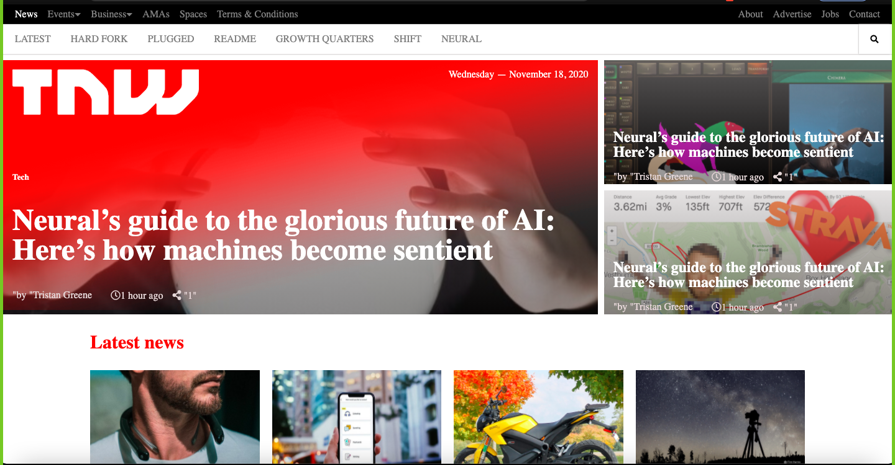

# The-Next-Web-Clone
This project aims to create a Heat Map of the page SmashingMagazine.com, The page works best on a 1366x768 resolution and using the Chrome browser.

## Built With

- HTML5
- CSS
- Font Awesome
- Google Fonts

## Live Demo

[Live Demo Link](https://dsunilk.github.io/Smashingmagazine-Clone/.)

👤 **Mar y Sol Bautista**

- GitHub: [@marilirulita](https://github.com/marilirulita)
- Linkedin: [@marilirulita](https://www.linkedin.com/in/mar-y-sol-bautista-alvarez-5a6894151/)
- Twiter: [@marilirulita](https://twitter.com/marylirulita)

👤 **Sunil Devalla**

- GitHub: [@DsunilK](https://github.com/DsunilK)
- Linkedin: [@DsunilK](https://www.linkedin.com/in/dsunilk/)
- Twiter: [@DsunilK](https://twitter.com/Sunil_Devalla)

## 🤝 Contributing

Contributions, issues, and feature requests are welcome!

Feel free to check the [issues page](https://github.com/DsunilK/Smashingmagazine-Clone/issues/).

## Show your support

Give a ⭐️ if you like this project!

## 📝 License

This project is [MIT](LICENSE) licensed.
